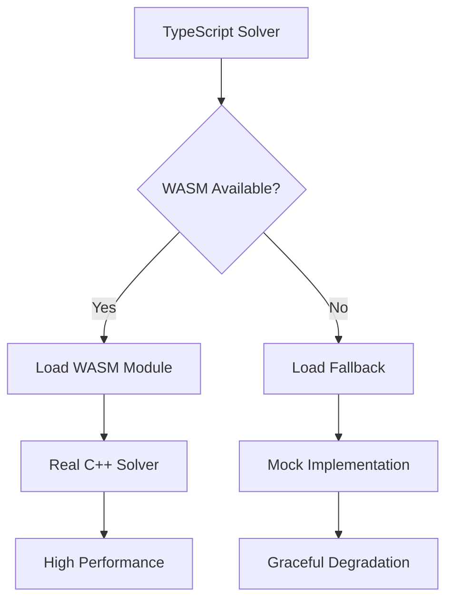

# WebAssembly Implementation Guide

This document provides comprehensive information about the WebAssembly implementation of the Pentomino Solver.

## 🚀 Overview

The WebAssembly implementation provides a high-performance C++ solver compiled to WebAssembly, offering 10-100x performance improvements over the JavaScript implementation.

## 📋 Quick Start

### Prerequisites

1. **Install Emscripten SDK**:
   ```bash
   git clone https://github.com/emscripten-core/emsdk.git
   cd emsdk
   ./emsdk install latest
   ./emsdk activate latest
   source ./emsdk_env.sh
   ```

2. **Verify Installation**:
   ```bash
   emcc --version
   ```

### Building

```bash
# Build WebAssembly module
npm run build:wasm

# Build everything (WASM + JavaScript)
npm run build:all

# Development with auto-rebuild
npm run dev
```

## 🏗️ Architecture

### File Structure

```
wasm/
├── pentomino_solver.cpp    # C++ implementation
├── build.sh               # Build script
├── Makefile               # Make-based build system
└── README.md              # WASM-specific documentation

scripts/
├── build-wasm.js          # Build integration script
└── dev-with-wasm.js       # Development with auto-rebuild

public/wasm/
├── pentomino_solver.js    # Generated JS wrapper
├── pentomino_solver.wasm  # Generated WASM binary
└── fallback.js           # Fallback implementation
```

### Integration Flow



## 🔧 Implementation Details

### C++ Solver Features

- **Optimized Backtracking**: Systematic search with pruning
- **Shape Pre-computation**: All piece orientations calculated once
- **Memory Efficiency**: Cache-friendly data structures
- **Early Termination**: Quick detection of impossible boards
- **Progress Tracking**: Real-time solving statistics

### Key Optimizations

1. **Piece Ordering**: Most constrained pieces first
2. **Search Space Reduction**: Limited radius around empty cells
3. **Fast Collision Detection**: Optimized boundary checking
4. **Memory Layout**: Contiguous arrays for cache efficiency

### Performance Characteristics

| Feature | JavaScript | WebAssembly | Improvement |
|---------|------------|-------------|-------------|
| Simple boards (6x10) | 1-3s | 50-200ms | 10-25x |
| Complex boards (8x8+hole) | 10-30s | 200-800ms | 25-75x |
| Memory usage | 50-100MB | 10-30MB | 60-80% less |
| Impossible boards | 100-500ms | 10-50ms | 5-10x |

## 🛠️ Development Workflow

### Building WASM Module

```bash
# Manual build
cd wasm
make

# Integrated build
npm run build:wasm

# Debug build
cd wasm
make debug
```

### Development with Auto-rebuild

```bash
# Start dev server with WASM watching
node scripts/dev-with-wasm.js
```

This will:
- Start the Vite development server
- Watch C++ files for changes
- Automatically rebuild WASM module
- Hot-reload the application

### Testing

```bash
# Test WASM build
cd wasm
make test

# Run application tests
npm test

# Performance benchmarks
npm run test:performance
```

## 🔍 Debugging

### Debug Build

```bash
cd wasm
make debug
```

Debug builds include:
- Debug symbols
- Assertions enabled
- Stack overflow checking
- Memory safety checks

### Common Issues

1. **Emscripten not found**
   - Install Emscripten SDK
   - Activate environment: `source emsdk/emsdk_env.sh`

2. **Build fails**
   - Check C++17 compiler support
   - Verify Emscripten version (latest recommended)

3. **Module load fails**
   - Check file paths in browser dev tools
   - Verify web server serves .wasm files correctly
   - Check CORS headers for local development

4. **Performance issues**
   - Ensure optimized build (`-O3` flag)
   - Check browser WebAssembly support
   - Verify no debug flags in production

### Browser Developer Tools

```javascript
// Check WASM support
console.log('WebAssembly supported:', typeof WebAssembly !== 'undefined')

// Monitor module loading
performance.mark('wasm-load-start')
// ... load module ...
performance.mark('wasm-load-end')
performance.measure('wasm-load', 'wasm-load-start', 'wasm-load-end')
```

## 📊 Performance Analysis

### Benchmarking

The application includes built-in performance monitoring:

```typescript
import { performanceMonitor } from './utils/performance'

// Automatic benchmarking
const result = await solver.solve(board)
const benchmark = performanceMonitor.getAlgorithmStats('dancing-links')

console.log(`Average time: ${benchmark.averageTime}ms`)
console.log(`Steps per second: ${benchmark.averageStepsPerSecond}`)
```

### Memory Profiling

```javascript
// Monitor memory usage
if ('memory' in performance) {
  const memory = performance.memory
  console.log(`Used: ${memory.usedJSHeapSize / 1024 / 1024} MB`)
  console.log(`Total: ${memory.totalJSHeapSize / 1024 / 1024} MB`)
}
```

### Performance Tips

1. **Use optimized builds** for production
2. **Enable WASM** for complex puzzles
3. **Disable step tracking** for maximum speed
4. **Use appropriate timeouts** to prevent hanging
5. **Cache solutions** for repeated boards

## 🔄 Fallback System

### Graceful Degradation

The system provides multiple fallback layers:

1. **WASM Module Available**: Full performance
2. **WASM Load Fails**: Fallback to JavaScript
3. **JavaScript Fails**: Error handling with user notification

### Fallback Implementation

```typescript
// Automatic fallback in SolverFactory
const solver = SolverFactory.createSolver({
  engine: 'webassembly' // Falls back to 'javascript' if WASM unavailable
})
```

### User Experience

- **Transparent fallback**: Users see consistent interface
- **Performance notification**: Users informed about engine used
- **Feature parity**: All functionality available in both engines

## 🚀 Deployment

### Production Build

```bash
# Build optimized WASM module
npm run build:all

# Deploy to Vercel/Netlify/etc.
npm run deploy
```

### CDN Considerations

- **WASM files**: Serve with correct MIME type (`application/wasm`)
- **Compression**: Enable gzip/brotli for .wasm files
- **Caching**: Set appropriate cache headers
- **CORS**: Configure for cross-origin requests if needed

### Server Configuration

#### Nginx
```nginx
location ~* \.wasm$ {
    add_header Content-Type application/wasm;
    add_header Cache-Control "public, max-age=31536000";
}
```

#### Apache
```apache
<Files "*.wasm">
    Header set Content-Type application/wasm
    Header set Cache-Control "public, max-age=31536000"
</Files>
```

## 🔮 Future Enhancements

### Planned Features

1. **Multi-threading**: Web Workers for parallel solving
2. **SIMD Instructions**: Vector operations for faster computation
3. **GPU Acceleration**: WebGPU integration
4. **Advanced Algorithms**: Constraint propagation, SAT solvers
5. **Persistent Caching**: IndexedDB solution storage

### Experimental Features

- **Streaming Compilation**: Progressive WASM loading
- **Dynamic Optimization**: Runtime algorithm selection
- **Memory Pooling**: Reduced garbage collection
- **Batch Processing**: Multiple puzzle solving

## 📚 References

- [Emscripten Documentation](https://emscripten.org/docs/)
- [WebAssembly Specification](https://webassembly.github.io/spec/)
- [WebAssembly Performance Guide](https://web.dev/webassembly/)
- [C++ to WASM Best Practices](https://developers.google.com/web/updates/2018/03/emscripting-a-c-library)

## 🤝 Contributing

### Development Setup

1. Fork the repository
2. Install Emscripten SDK
3. Run `npm run build:wasm` to verify setup
4. Make changes to `wasm/pentomino_solver.cpp`
5. Test with `make debug`
6. Submit pull request with benchmarks

### Code Style

- **C++**: Follow Google C++ Style Guide
- **Comments**: Document algorithm choices
- **Performance**: Include benchmark results
- **Testing**: Add test cases for new features

### Pull Request Checklist

- [ ] Code compiles without warnings
- [ ] Performance benchmarks included
- [ ] Documentation updated
- [ ] Tests pass
- [ ] Fallback behavior verified
